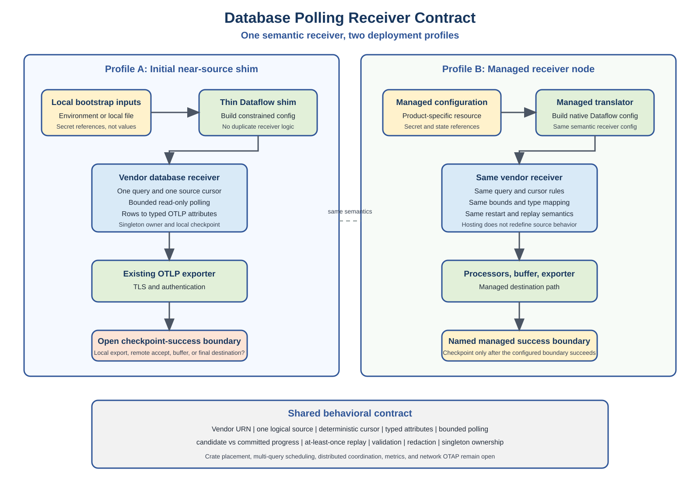

# Database Polling Receiver Contract and Initial Near-Source Deployment Profile

<!-- markdownlint-disable MD013 -->

Status: proposed

Related issues:

- [Shared runtime and vendor-specific database polling receivers](https://github.com/open-telemetry/otel-arrow/issues/3918)
- [Common source coordination runtime](https://github.com/open-telemetry/otel-arrow/issues/4001)

Companion design:

- [Agent-Based Database Receiver Architecture Skeleton](database-receiver-agent-architecture/README.md)

## Purpose

This document proposes the minimum behavioral contract for a database polling
receiver and describes two ways to host the same receiver:

1. An initial near-source binary that generates a constrained OTAP Dataflow
   configuration and exports OTLP to another collector.
2. A managed deployment where the receiver runs directly in an OTAP Dataflow
   pipeline.

The contract deliberately separates receiver behavior from product-specific
configuration delivery, packaging, and destination provisioning. A receiver
must preserve the same source, mapping, resource, and delivery semantics in
both deployment profiles.

This document defines a contract for review. It does not approve a permanent
crate hierarchy or require the full multi-vendor runtime to be implemented in
one pull request.

The companion architecture skeleton makes one candidate crate graph concrete
so its dependency direction, link-time registration, and agent composition can
be reviewed without treating the proposed crate names or APIs as approved.

## Decision language

This document uses three labels:

- **Required**: part of the proposed first receiver contract.
- **Proposed**: recommended initial behavior that needs maintainer agreement.
- **Open**: intentionally unresolved and not safe to infer from this document.

## Summary

The first implementation should be one vendor-specific receiver node with one
logical query, one source position, and one active owner. The receiver runs a
bounded read-only query, maps each selected database column to a typed OTLP log
attribute, exports through a normal OTAP Dataflow pipeline, and persists source
progress only after its configured delivery boundary reports success.

Public receiver identity is vendor-specific:

```text
urn:otel:receiver:oracle
urn:otel:receiver:postgresql
urn:otel:receiver:mysql
urn:otel:receiver:sql_server
```

Only implemented vendor components are registered. Shared polling behavior does
not create a public `urn:otel:receiver:database` component.

## Plain-English model

The parts have different jobs:

- **OTAP Dataflow engine:** the runtime that starts nodes, moves telemetry
  between them, applies backpressure, and reports completion.
- **Database receiver:** a source node that asks one database query for the next
  bounded page of rows and turns those rows into OpenTelemetry logs.
- **Vendor adapter:** the only layer that understands a particular driver,
  parameter syntax, native types, cancellation API, and connection behavior.
- **Shared polling behavior:** the reusable state machine for scheduling,
  bounds, candidate progress, checkpoint commit, retry, and shutdown.
- **Near-source shim:** a thin application that converts a small local input
  contract into normal Dataflow configuration. It hosts the receiver but does
  not reimplement it.
- **Downstream collector:** the process that receives OTLP, performs optional
  transformations, and exports to a destination.
- **Checkpoint:** the receiver's durable bookmark. It records what can be
  skipped after restart, so it must advance only after the selected delivery
  boundary succeeds.

The design is intentionally shaped like a replaceable outer shell around one
receiver contract. Moving from a near-source shim to managed hosting changes
how configuration arrives and where success is observed; it must not change
what the query means or how rows and progress are interpreted.

## Goals

- Define one reusable behavioral contract for vendor database receivers.
- Keep vendor drivers and native dependencies independently selectable.
- Support bounded, non-overlapping, read-only query polling.
- Preserve database scalar values without silent precision loss.
- Define a deterministic database-row-to-OTLP-log mapping.
- Make source progress conditional on an explicit delivery-success boundary.
- Preserve at-least-once delivery across retry and restart.
- Support a lightweight near-source deployment without creating a second
  receiver implementation.
- Preserve a path to managed pipeline configuration and hosting.
- Make unresolved product and architecture decisions visible.

## Non-goals

The first contract does not define:

- a generic public database receiver selected by a `system` field;
- multiple independently scheduled queries inside one receiver node;
- database metrics or a generic row-to-any-signal mapping;
- change data capture or transaction-log decoding;
- distributed ownership, active/active polling, or source rebalancing;
- a universal SQL parser or automatic rewriting of arbitrary SQL;
- customer-specific transformations or destination-table provisioning;
- client-side Parquet generation;
- a network OTAP requirement;
- a permanent shared crate location;
- exactly-once source-to-destination delivery.

## Why the contract precedes a crate skeleton

Creating a crate establishes dependency direction and a long-lived public code
boundary. The current open decisions include whether common polling belongs in
an existing node crate, a new scraper crate, or a broader source-runtime crate.

The safer sequence is:

1. Agree on behavior that every vendor must preserve.
2. Implement the narrow interfaces required by the first vendor.
3. Place those interfaces where the demonstrated dependency graph fits.
4. Extract additional abstractions only when a second vendor proves they are
   actually shared.

This avoids both a vendor-specific implementation copied for every database
and a premature framework that makes the first receiver harder to deliver.

## Reconciliation of design directions

The contract intentionally narrows several broader design options:

| Concern | Initial contract | Deferred extension |
| --- | --- | --- |
| Public component | One vendor-specific receiver URN | No generic vendor selector is planned |
| Shared code | Internal polling and checkpoint behavior | Permanent crate placement |
| Query ownership | One query and one logical source per node | Multi-query scheduler |
| Log mapping | All selected columns as typed attributes | Final body representation |
| Transport | OTLP for the near-source profile | Network OTAP evaluation |
| Transformations | Minimal source normalization | Customer-specific downstream transforms |
| Progress | Profile-specific named delivery boundary | Cross-process final-destination protocol |
| Scaling | One owner; multiple explicit receiver nodes/ranges | Distributed source coordination |

This is not a rejection of a reusable multi-database runtime. It defines the
smallest externally understandable unit first, then allows reuse to grow behind
that boundary.

## Architecture



The diagram has three important boundaries:

1. **Bootstrap binding** converts local or managed inputs into semantic receiver
   configuration.
2. **Vendor receiver contract** defines source behavior independently of its
   host.
3. **Delivery profile** determines what success means before the source
   checkpoint can advance.

## Terminology

| Term | Meaning |
| --- | --- |
| Semantic receiver configuration | Validated configuration consumed by the vendor receiver, independent of how a product or shim obtained it. |
| Bootstrap binding | A thin adapter that converts environment variables, a local file, or a managed configuration resource into semantic receiver configuration. |
| Logical source | One database identity, one query, one source range, and one checkpoint identity. |
| Candidate cursor | The source position represented by rows sent in one publication but not yet durably committed. |
| Committed cursor | The latest source position durably recorded after delivery success. |
| Delivery boundary | The component or system whose success permits the receiver to commit its candidate cursor. |
| Near-source profile | A lightweight OTAP Dataflow binary near the database that exports OTLP to another collector. |
| Managed profile | A pipeline where the database receiver and managed processors/exporters run under one configuration system. |

## Component identity

**Required:** each database vendor has its own receiver type and configuration.

The canonical full identifier follows the repository URN convention:

```text
urn:otel:receiver:<vendor>
```

Vendor-specific public types are required because drivers differ in:

- configuration and authentication;
- TLS and native client packaging;
- parameter syntax;
- cancellation behavior;
- metadata and scalar types;
- failover and reconnect behavior;
- licensing and vulnerability response.

Shared implementation is still expected. Public component identity and internal
code reuse are separate decisions.

## Contract boundaries

### Common polling responsibilities

The following behaviors are candidates for shared implementation:

- interval and poll-cycle state;
- no-overlap enforcement;
- row, normalized-memory, and encoded-payload budgets;
- downstream backpressure handling;
- candidate and committed progress state;
- ACK, NACK, timeout, and replay behavior;
- checkpoint envelope validation and atomic persistence;
- common low-cardinality telemetry;
- lifecycle, drain, and shutdown coordination.

### Vendor receiver responsibilities

Each vendor receiver owns:

- connection and session creation;
- authentication and TLS options;
- parameter binding;
- read-only session configuration;
- SQL and cursor validation;
- result metadata;
- native scalar conversion;
- driver fetch and prefetch limits;
- native timeout and cancellation;
- reconnect and fatal-connection classification;
- vendor driver and native-library packaging.

### Bootstrap responsibilities

A bootstrap shim may:

- read a small documented local input contract;
- resolve non-secret endpoint and query settings;
- reference mounted credentials or a credential provider;
- generate a constrained OTAP Dataflow configuration;
- select one enabled vendor receiver;
- connect it to an OTLP exporter;
- start the normal Dataflow engine.

The shim must not implement its own scheduler, database adapter, row mapper,
checkpoint state machine, retry path, or exporter.

## Why this structure is maintainable

### New database onboarding

A new database receiver should implement the vendor adapter responsibilities
and reuse the common behavioral contract. Its review can then focus on the
driver, binds, types, cancellation, and packaging instead of re-reviewing the
entire polling state machine.

### Reliability

Candidate and committed progress are separate states, resource limits exist at
each expansion boundary, and delivery success is named rather than assumed.
These choices make retry and restart behavior reviewable and testable.

### Scaling

The first receiver is intentionally single-owner, not single-source forever.
Deployments can create multiple receiver nodes for explicitly disjoint sources
or ranges and use normal pipeline fanout for downstream parallelism. A future
coordinator can assign those stable ranges without changing row mapping or
checkpoint meaning.

### Operational isolation

One query per node gives each logical source independent configuration,
checkpoint state, telemetry, backpressure, and failure lifecycle. A slow or
invalid query does not become hidden inside an in-node job scheduler.

### Product independence

Bootstrap and managed bindings translate into the same semantic configuration.
The receiver therefore does not depend on one control plane, installation
method, destination product, or user interface.

## Initial receiver scope

**Proposed:** one receiver node represents one logical source:

```text
database identity
  + one operator-authored query
  + one cursor definition
  + one optional source range
  + one checkpoint identity
```

Multiple independent sources use multiple receiver nodes. This avoids adding a
multi-job scheduler, shared connection-pool failure coupling, per-job lifecycle,
and per-job checkpoint namespaces before the first contract is validated.

Multi-query receiver instances remain an open future extension.

## Semantic configuration layers

The same semantic receiver configuration must be reachable through different
bindings.

```text
Near-source:
local inputs -> bootstrap binding -> semantic receiver config

Managed:
managed resource -> managed translator -> semantic receiver config
```

The receiver must not know whether its configuration originated from
environment variables, a local file, an API, or a managed resource.

### Local bootstrap input

**Proposed:** the initial near-source shim accepts a small, versioned local
contract. Environment variables may be one binding, but they are not the
semantic receiver schema.

The initial input should expose only:

- vendor receiver selection;
- non-secret database endpoint and database/service identity;
- a query or protected query-file reference;
- interval and bounded execution limits;
- cursor fields and initial position;
- credential references, never inline secret values;
- checkpoint state directory;
- destination OTLP endpoint and TLS settings.

It should not expose arbitrary pipeline construction.

### Managed input

Managed configuration may use a different external schema, but it must
translate into the same semantic receiver configuration and preserve the same
validation rules.

Product-specific resource schemas, user interfaces, and destination
provisioning are outside this contract.

## Credentials and sensitive configuration

**Required:**

- Passwords and equivalent secret values are never written into generated
  Dataflow YAML, command-line arguments, logs, metrics, or checkpoint files.
- Local deployment uses mounted files or an approved credential-provider
  capability.
- Managed deployment resolves secret references at runtime.
- Secret paths and secret values are excluded from semantic fingerprints.
- A non-secret effective principal or schema identity is included when it
  changes the meaning of unqualified SQL.
- Connection strings, SQL, row values, bind values, and cursor values are
  treated as sensitive.
- Production TLS verifies server identity. Insecure transport is an explicit,
  visible opt-in.

Environment variables may control the shim without requiring secret values to
be environment variables.

## Polling contract

### Required behavior

- A configured interval controls when the logical source is eligible to poll.
- The same logical source never has overlapping query executions.
- The first query, query calls, page conversion, and shutdown are bounded.
- Downstream backpressure stops admission of additional pages.
- Row count, normalized application bytes, and encoded payload bytes have
  independent bounds.
- A single oversized row or scalar follows an explicit failure policy and is
  never silently truncated.
- Shutdown stops admitting new queries and attempts to cancel active work.

### Open scheduling choices

- immediate first poll versus startup jitter;
- exact missed-tick behavior;
- immediate catch-up until the current tail versus one page per interval;
- transient retry backoff and its interaction with the normal interval;
- future fairness and concurrency across multiple query jobs.

The implementation must document the selected behavior rather than relying on
timer-library defaults.

## Source cursor and consistency contract

The first incremental receiver uses deterministic keyset polling.

**Proposed:** the initial cursor is a timestamp plus a stable unique
tie-breaker:

```sql
WHERE updated_at > :last_timestamp
   OR (
        updated_at = :last_timestamp
        AND event_id > :last_event_id
      )
ORDER BY updated_at ASC, event_id ASC
```

The receiver validates:

- both cursor columns are present;
- cursor values are non-null and representable;
- returned rows are strictly ordered;
- every returned cursor is greater than the committed cursor;
- the final candidate is the last row actually emitted.

### Transaction-visibility limitation

Keyset ordering is not automatically commit ordering. Timestamps, sequences,
identity columns, and auto-increment values can be assigned in an order that
differs from transaction visibility.

**Required:** configuration and documentation state that:

- checkpoint columns remain unchanged after a row becomes visible; and
- the source provides a position ordered by visibility, or the deployment uses
  an explicit overlap/deduplication policy or a vendor-specific mechanism.

When the source cannot provide a safe polling position, change data capture is
the more reliable design.

## Row-to-OTLP log contract

**Proposed initial mapping:**

- One database row produces one OTLP `LogRecord`.
- Every selected database column is represented as a typed log attribute using
  a deterministic conversion policy.
- `ObservedTimestamp` is always set by the receiver.
- A configured event-time column may populate `Timestamp`.
- Source metadata uses reserved, documented attribute names.
- Decimal and wide numeric values use precision-preserving representations.
- Null, binary, temporal, JSON, unsupported, and oversized values have explicit
  documented behavior.
- Duplicate column names after normalization are rejected.
- Receiver-generated attribute names cannot collide with selected columns.

The initial log-body representation is **open**. Consumers must not depend on a
duplicated structured body until the contract chooses empty body, structured
body, or configurable body behavior.

Database metrics are a valid future use case, but their instrument, temporality,
label, and multi-row/multi-datapoint semantics require a separate contract.

## Delivery and checkpoint contract

### At-least-once behavior

The receiver maintains a candidate cursor separately from the committed cursor.

```text
load committed cursor
  -> query bounded page
  -> map and send publication
  -> delivery boundary reports success
  -> atomically persist candidate cursor
  -> candidate becomes committed
```

NACK, timeout, process termination, unresolved delivery, or checkpoint failure
does not advance source progress.

A process can fail after the destination accepts data but before checkpoint
commit. The publication can therefore be replayed. Exactly-once delivery is not
claimed.

### Delivery boundary is profile-specific

The phrase "downstream ACK" is insufficient unless the boundary is named.

For every deployment profile, configuration or documentation must state whether
success means:

- acceptance by the local OTLP exporter;
- acceptance by a remote OTLP receiver;
- durable-buffer acceptance;
- completion by a final required exporter.

The initial near-source OTLP profile does not automatically provide the same
in-process ACK chain as a single managed OTAP pipeline.

**Open:** the exact success boundary for the initial near-source profile.

Until it is selected, the design must not claim end-to-end checkpointing to the
final destination.

### Checkpoint requirements

- State is versioned and checksummed.
- The source/configuration fingerprint covers every non-secret semantic input.
- An incompatible fingerprint fails closed and requires reset or migration.
- Writes are atomic and monotonic.
- State size and retained revisions are bounded.
- Checkpoint I/O is deadline-aware.
- Local files are recovery state, not distributed ownership.

## Ownership

**Required initial rule:** one active process and one receiver instance own a
logical source.

In an engine that normally creates per-core pipeline instances, an
unpartitioned source pipeline must be constrained to one core and must reject a
duplicate local source identity.

The initial contract does not support:

- multiple processes polling the same source range;
- automatic failover;
- active/active polling;
- dynamic source assignment;
- checkpoint fencing across processes.

Future coordinated ownership may assign stable, explicitly non-overlapping
query ranges to receiver-local agents. Core number must never be part of source
or checkpoint identity.

## Driver and dependency contract

- Vendor drivers are optional and independently gated.
- Shared polling code does not depend on any vendor driver.
- Enabling one receiver does not enable unrelated database drivers.
- Blocking/native calls do not run on a single-threaded Dataflow core.
- Blocking work is bounded, cancel-aware, backpressure-aware, and observable.
- A connection whose cancellation state is unknown is not reused.
- Supported driver versions, native-client versions, database versions,
  licenses, and vulnerability response are documented release decisions.

The first contract does not choose the permanent crate layout. A future shared
scraper crate is one option, but the behavioral boundary must be accepted before
code is moved around it.

## Validation

Validation occurs in two phases.

### Static validation

- Reject unknown fields.
- Validate identifiers, intervals, timeouts, and positive bounds.
- Validate source identity and checkpoint namespace.
- Validate credential references without reading secret values into errors.
- Validate cursor shape and bind names.
- Validate that the selected deployment profile has a named success boundary.

### Source preflight

- Connect using the selected vendor adapter.
- Prepare the statement.
- Bind representative cursor values.
- Inspect result metadata.
- Validate selected columns and unique normalized names.
- Validate cursor types, nullability, and representability.
- Validate row-to-OTLP conversion rules.
- Report errors without starting continuous ingestion.

Runtime schema changes fail the affected source rather than silently changing
mapping or checkpoint meaning.

## Deployment profiles

### Profile A: initial near-source shim

```text
local bootstrap inputs
  -> thin OTAP Dataflow shim
  -> vendor database receiver
  -> OTLP exporter
  -> remote OTLP receiver
  -> processors and destination exporter
```

The shim is intentionally small. It assembles existing crates and components;
it does not fork receiver behavior.

The profile must separately define:

- checkpoint storage and persistence across upgrade/restart;
- one-process ownership;
- OTLP authentication and TLS;
- delivery-success semantics across the network boundary;
- behavior while the remote collector is unavailable;
- local installation, upgrade, and diagnostics.

### Profile B: managed receiver node

```text
managed configuration
  -> native OTAP Dataflow configuration
  -> vendor database receiver
  -> processors, buffer, and destination exporter
```

The managed profile may have a richer in-process ACK path and managed state
mounts. It must preserve the same source cursor, mapping, bounds, security, and
restart semantics.

## Transformations and destinations

The receiver is responsible for:

- source query execution;
- native-to-neutral scalar conversion;
- deterministic selected-column-to-attribute mapping;
- event timestamp selection;
- stable source metadata.

Customer-specific field renaming, destination projection, KQL-like transforms,
standard-table semantics, and Parquet creation are not required receiver work.
They may occur in downstream processors or product-specific integrations.

The initial near-source profile prefers minimal transformation. The Dataflow
engine remains capable of local transforms when a deployment explicitly needs
them.

Destination table creation, schema evolution, routing metadata, and managed
resource lifecycle are outside this receiver contract.

## Telemetry

Common telemetry must be low cardinality and must not expose sensitive source
data.

Useful receiver diagnostics include:

- polls started, completed, and failed;
- rows and normalized bytes read;
- publications sent;
- ACK, NACK, timeout, and replay counts;
- checkpoint commits and failures;
- cancellation and shutdown outcomes;
- time since last successful poll;
- catch-up state when implemented.

SQL, table names, endpoints, source values, cursor values, row values, and raw
error strings are not metric dimensions.

Shared receiver metrics and database-specific diagnostics must not duplicate
node producer/consumer metrics.

## Minimum tests

### Contract tests

- unknown and unsafe configuration rejection;
- cursor ordering and equal-timestamp tie-breaking;
- no overlapping query execution;
- row, normalized-byte, and encoded-byte bounds;
- unsupported and oversized value behavior;
- deterministic attribute mapping and collision rejection;
- candidate versus committed cursor state;
- ACK commit, NACK replay, timeout replay, and stale feedback;
- checkpoint corruption, mismatch, atomicity, and restart;
- cancellation and bounded shutdown;
- secret and SQL redaction.

### Vendor adapter tests

- connection, authentication, and TLS;
- bind translation;
- metadata and type conversion;
- timeout, cancellation, and unhealthy connection disposal;
- supported database/native-client versions.

### Near-source profile tests

- local input to generated configuration;
- selected vendor-only feature packaging;
- persistent checkpoint across shim restart;
- OTLP interoperability with the remote collector;
- remote outage, retry, and replay;
- explicit delivery-success boundary;
- typed attribute preservation through the destination path.

## Proposed pull request sequence

### PR 1: contract only

This document and its diagram.

The PR requests agreement on:

- vendor-specific public identity;
- one-query/one-source initial scope;
- typed attribute mapping;
- source cursor and transaction-visibility limitations;
- at-least-once delivery vocabulary;
- profile-specific success boundaries;
- initial singleton ownership;
- semantic configuration versus bootstrap bindings;
- dependency, security, validation, and test boundaries.

It does not add a crate or production code.

### PR 2: shared behavioral interfaces

After PR 1 is accepted, add only the interfaces and test harness needed by the
first vendor:

- bounded polling source;
- cursor-carrying page;
- mapping contract;
- progress-store interface;
- completion state;
- adapter conformance tests.

Crate placement is decided in this PR with maintainer input. A dedicated
scraper crate is a candidate, not a conclusion from PR 1.

### PR 3: first vendor receiver

Implement one vendor receiver behind its own feature with:

- static and source-preflight validation;
- bounded polling;
- typed attributes;
- singleton ownership;
- checkpoint and replay;
- real database integration tests.

### PR 4: near-source shim

Assemble published or workspace Dataflow crates into the constrained bootstrap
binary and prove OTLP interoperability with the remote collector.

### Later PRs

- managed configuration translation;
- additional vendor receivers;
- common source coordination and partitions;
- database metrics;
- optional row-view or pluggable representation optimizations;
- CDC-specific receiver families.

## Open decisions

The design review must explicitly resolve or defer:

1. Exact vendor URN names.
2. Empty, structured, or configurable log body.
3. Initial near-source delivery-success boundary.
4. Checkpoint location and lifecycle for the shim.
5. Environment variable names versus a local configuration file.
6. Query text inline versus protected file reference.
7. Immediate catch-up versus one page per interval.
8. Startup jitter and transient retry policy.
9. Permanent shared-code or scraper-crate location.
10. Future multi-query support.
11. Product-specific managed configuration schema.
12. Local versus downstream transformation placement.
13. OTLP versus future OTAP network transport.
14. Future database metrics semantics.
15. Distributed lease and partition integration.

## Acceptance criteria for this contract

- The same receiver semantics apply to near-source and managed profiles.
- Vendor-specific public identity and dependency isolation are explicit.
- One logical source and singleton ownership are unambiguous.
- Cursor correctness and transaction-visibility limitations are documented.
- Typed attribute mapping is deterministic and destination-independent.
- Delivery success is named per deployment profile.
- Checkpoint advancement cannot be confused with query or transport success.
- Secrets and sensitive database data have explicit handling rules.
- Validation and minimum tests cover the new near-source boundary.
- Every unresolved architecture or product choice is listed rather than
  silently selected.
