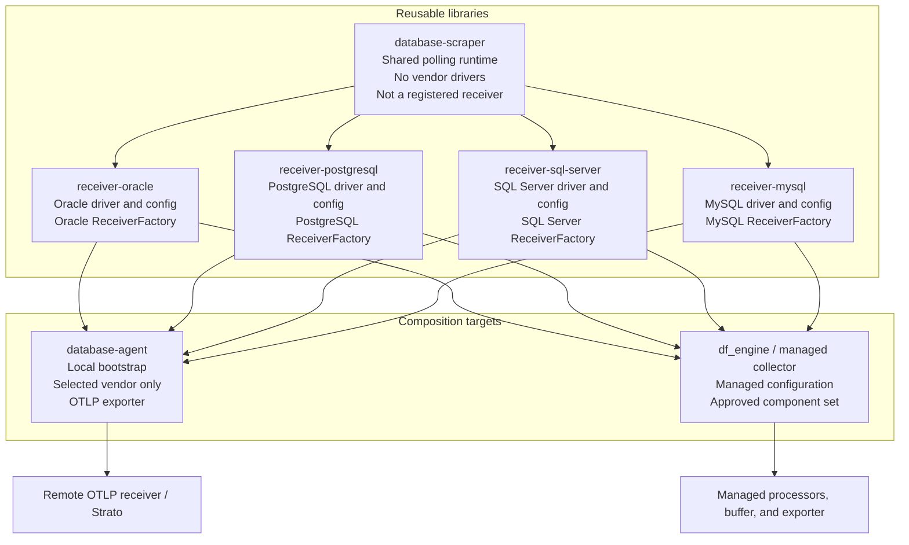
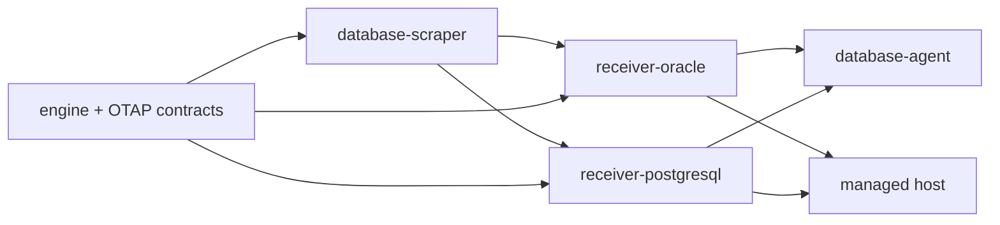
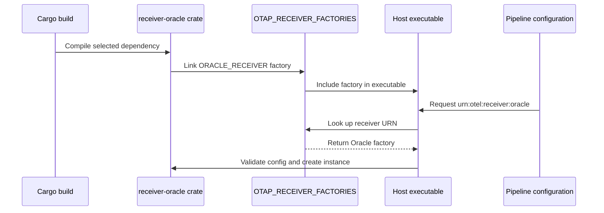
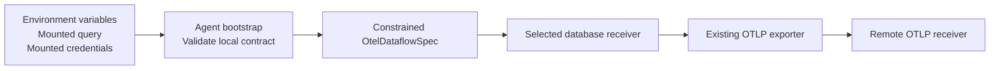
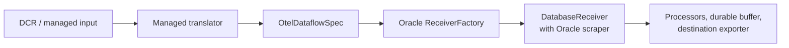
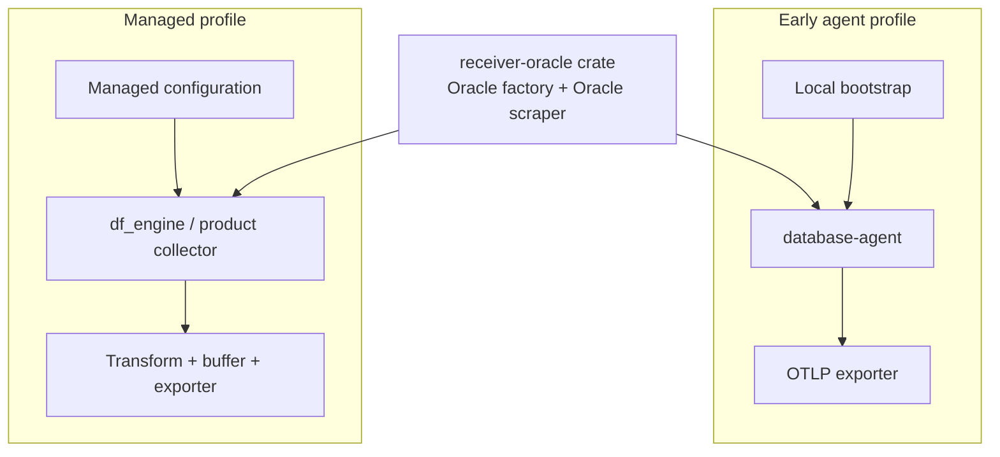
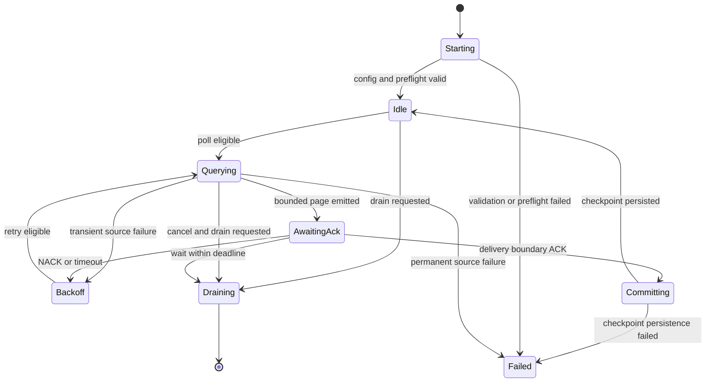
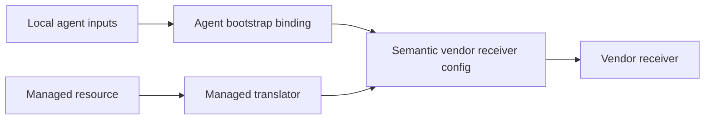
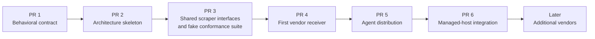

# Agent-Based Database Receiver Architecture Skeleton

<!-- markdownlint-disable MD013 -->

Status: proposed design skeleton

Related documents:

- [Database Polling Receiver Contract](../database-polling-receiver-contract.md)
- [OTAP Dataflow Architecture](../architecture.md)
- [Shared runtime and vendor-specific database polling receivers](https://github.com/open-telemetry/otel-arrow/issues/3918)

## Purpose

This document demonstrates a crate and application structure for delivering a
database polling receiver in two forms:

1. a small customer-side agent binary for early delivery; and
2. a receiver component linked into a managed OTAP Dataflow host.

Both forms use the same receiver implementation. The agent is a constrained
configuration and packaging layer, not a second polling engine.

In this document, **agent** means a locally deployed collection process. It
does not mean an AI agent, an autonomous connector generator, or a process
installed on the database server.

This is a design-only skeleton. It does not select database drivers, publish
crates, register production components, or implement polling.

It is the concrete version of the proposed thin Rust shim or wrapper: the
[`database-agent`](../../crates/database-agent/src/main.rs) supplies local
configuration and starts the normal Dataflow controller. It does not own a
receiver implementation. The independently reusable receiver crates are what
both the agent and a managed host link.

The pseudocode is located at the actual intended implementation paths under
`crates/` and `src/`, rather than in a documentation mirror. These unfinished
crates are explicitly excluded from the Cargo workspace so the design cannot
be mistaken for compiling production code. Each exclusion should be removed
when that crate is implemented and its normal checks pass.

## Meeting-guidance traceability

This design translates Drew's delivery guidance into repository boundaries:

| Meeting direction | Design response |
| --- | --- |
| Deliver another OTel Arrow binary before new control-plane support exists | `database-agent` is a separate, constrained OTAP Dataflow binary |
| Use a thin Rust shim or wrapper | The agent only reads local inputs, creates `OtelDataflowSpec`, validates it, and starts the existing controller |
| Read environment variables for early customer delivery | `AgentInput` is a small versioned environment and mounted-file contract |
| Reuse OTel Arrow receiver, exporter, configuration, and packaging infrastructure | Vendor crates use `ReceiverFactory`; the agent uses the normal controller and existing OTLP exporter |
| Avoid pulling every database integration into every build | Each vendor receiver is an optional sibling crate with its driver isolated to that crate |
| Keep reusable modules suitable for future product integration | The same vendor `ReceiverFactory` can be linked into `database-agent` or a managed `df_engine` distribution |
| Send to Strato without waiting for a new DCR data-source experience | The agent receives an OTLP endpoint as local input and sends through the existing OTLP exporter |

The meeting selected the delivery and packaging direction, not the final
adapter API, driver libraries, checkpoint format, or delivery-success
semantics. Those details remain proposals and must be reviewed independently.

### Implementation constraints carried into this skeleton

The working standalone prototype demonstrates several implementation
requirements that should carry into the OTAP-native version:

- use explicit scalar or composite key columns and explicit vendor bind
  mappings instead of rewriting SQL;
- include worker/session admission time in the query deadline;
- bound Oracle blocking work, sessions, fetch arrays, statement caching, secret
  file size, rows, and normalized bytes;
- retire an Oracle session before requesting cancellation and do not reuse it
  until query/break reconciliation proves it healthy;
- fingerprint query, cursor, mapping, and destination semantics in checkpoint
  identity;
- probe checkpoint storage and use bounded, revisioned, atomic local-file
  persistence for the single-instance profile; and
- fail closed when delivery or checkpoint persistence is uncertain.

The standalone implementation should not be copied wholesale. It owns a
separate scheduler, pipeline runtime, exporters, and `Send + Sync` worker
model. This design instead reuses OTAP Dataflow's controller, local runtime,
component factories, backpressure, pdata, and exporter behavior so the same
receiver remains usable in the managed host.

## No-DCR/AMCS bootstrap boundary

The early-delivery agent has no DCR or AMCS configuration client:

```text
environment variables + mounted files
                  |
                  v
          database-agent bootstrap
                  |
                  v
       constrained OtelDataflowSpec
                  |
                  v
 vendor receiver -> existing OTLP exporter -> supplied Strato endpoint
```

The agent does not fetch a DCR, poll AMCS, depend on portal support, or require
a new database data-source type. A deployment may still use an already
provisioned downstream Strato OTLP endpoint; that does not make DCR or AMCS
part of the agent's bootstrap path.

## Pseudocode artifact map

| Design concern | Concrete artifact |
| --- | --- |
| Shared vendor-neutral adapter contract | [`database-scraper/src/driver.rs`](../../crates/database-scraper/src/driver.rs) |
| Shared polling and checkpoint state machine | [`database-scraper/src/poller.rs`](../../crates/database-scraper/src/poller.rs) |
| Checkpoint ownership and concurrency | [`database-scraper/src/checkpoint.rs`](../../crates/database-scraper/src/checkpoint.rs) |
| ACK/NACK completion decisions | [`database-scraper/src/completion.rs`](../../crates/database-scraper/src/completion.rs) |
| Oracle-specific driver boundary | [`receiver-oracle/src/driver.rs`](../../crates/receiver-oracle/src/driver.rs) |
| Oracle factory registration | [`receiver-oracle/src/factory.rs`](../../crates/receiver-oracle/src/factory.rs) |
| Thin agent startup | [`database-agent/src/main.rs`](../../crates/database-agent/src/main.rs) |
| Local-input-to-pipeline translation | [`database-agent/src/pipeline.rs`](../../crates/database-agent/src/pipeline.rs) |
| Workspace and optional host dependencies | [`Cargo.toml`](../../Cargo.toml) |
| Managed-host side-effect imports | [`src/main.rs`](../../src/main.rs) |

## Design goals

- Keep common polling behavior independent of every database driver.
- Package each vendor receiver and its dependencies independently.
- Let a purpose-built agent include only the required receiver.
- Let `df_engine` link the same receiver crate as a normal component.
- Reuse the existing `ReceiverFactory` and link-time registration model.
- Keep configuration delivery separate from receiver semantics.
- Preserve the same mapping, checkpoint, and delivery behavior in every host.
- Avoid a dependency on `contrib-nodes` and its unrelated integrations.

## Non-goals

- Runtime loading of `.dll` or `.so` plugins.
- A universal SQL dialect or connection configuration.
- A generic public `urn:otel:receiver:database` component.
- A second polling implementation inside the agent.
- Dynamic installation of a new receiver into an already-built executable.
- Final database-driver, checkpoint-backend, or destination choices.

## Architecture at a glance



The arrows from `database-scraper` to the vendor crates mean that vendor
crates depend on the shared runtime. The shared runtime never depends on a
vendor crate.

## Proposed crate graph

```text
rust/otap-dataflow/crates/
|
+-- database-scraper/
|   +-- Cargo.toml
|   +-- src/
|       +-- lib.rs
|       +-- config.rs
|       +-- driver.rs
|       +-- poller.rs
|       +-- row.rs
|       +-- mapping.rs
|       +-- cursor.rs
|       +-- checkpoint.rs
|       +-- completion.rs
|       +-- lifecycle.rs
|       +-- metrics.rs
|
+-- receiver-oracle/
|   +-- Cargo.toml
|   +-- src/
|       +-- lib.rs
|       +-- config.rs
|       +-- driver.rs
|       +-- values.rs
|       +-- factory.rs
|       +-- error.rs
|
+-- receiver-postgresql/
|   +-- Cargo.toml
|   +-- src/
|       +-- lib.rs
|       +-- config.rs
|       +-- driver.rs
|       +-- values.rs
|       +-- factory.rs
|       +-- error.rs
|
+-- receiver-sql-server/
|   +-- Cargo.toml
|   +-- src/
|       +-- lib.rs
|       +-- config.rs
|       +-- driver.rs
|       +-- values.rs
|       +-- factory.rs
|       +-- error.rs
|
+-- receiver-mysql/
|   +-- Cargo.toml
|   +-- src/
|       +-- lib.rs
|       +-- config.rs
|       +-- driver.rs
|       +-- values.rs
|       +-- factory.rs
|       +-- error.rs
|
+-- database-agent/
    +-- Cargo.toml
    +-- src/
        +-- main.rs
        +-- input.rs
        +-- bootstrap.rs
        +-- pipeline.rs
        +-- error.rs
```

Crate names are placeholders. The dependency boundaries are the proposal.

## Crate responsibilities

| Crate | Registered component | Vendor dependencies | Responsibility |
| --- | --- | --- | --- |
| `database-scraper` | None | None | Shared bounded polling, mapping, checkpoint, completion, lifecycle, and telemetry behavior |
| `receiver-oracle` | `urn:otel:receiver:oracle` | Oracle only | Oracle configuration, connection, binds, cancellation, metadata, and value conversion |
| `receiver-postgresql` | `urn:otel:receiver:postgresql` | PostgreSQL only | PostgreSQL configuration, connection, binds, cancellation, metadata, and value conversion |
| `receiver-sql-server` | `urn:otel:receiver:sql_server` | SQL Server only | SQL Server configuration, connection, binds, cancellation, metadata, and value conversion |
| `receiver-mysql` | `urn:otel:receiver:mysql` | MySQL only | MySQL configuration, connection, binds, cancellation, metadata, and value conversion |
| `database-agent` | None | Selected receivers only | Read local inputs, construct constrained Dataflow configuration, and run the standard controller |

## Dependency rules



The diagram is read left to right as "is a dependency of." The required rules
are:

1. `database-scraper` depends only on host-neutral Dataflow and pdata contracts.
2. A vendor receiver depends on `database-scraper` and its own driver.
3. Vendor receivers do not depend on one another.
4. `database-scraper` contains no optional vendor dependencies.
5. The agent depends only on the receiver crates selected for that distribution.
6. `df_engine` may expose Cargo features that link selected receiver crates.
7. No database crate depends on `contrib-nodes`.

This avoids the undesirable graph:

```text
receiver-oracle
  -> contrib-nodes
      -> unrelated receiver and exporter dependency surface
```

## Shared scraper boundary

The shared crate owns behavior that must remain consistent across vendors:

```text
poll eligibility and no-overlap enforcement
  -> bounded page admission
  -> downstream backpressure
  -> candidate cursor tracking
  -> row-to-OTLP mapping
  -> Ack/Nack correlation
  -> checkpoint commit or replay
  -> drain and shutdown coordination
```

The vendor crate owns behavior that depends on the selected database:

```text
connect and establish a read-only session
  -> prepare and bind the query
  -> fetch rows without unbounded materialization
  -> expose metadata
  -> convert native values into neutral values
  -> cancel work
  -> classify connection and driver failures
```

### Illustrative adapter contract

The first implementation should introduce only the methods demonstrated by the
first vendor. A possible shape is:

```rust
pub trait DatabaseScraper {
    type Config;
    type Cursor;

    async fn open(config: &Self::Config) -> Result<Self, ScrapeError>
    where
        Self: Sized;

    async fn preflight(&mut self, request: PreflightRequest<'_>)
        -> Result<ResultSchema, ScrapeError>;

    async fn scrape(
        &mut self,
        request: ScrapeRequest<'_, Self::Cursor>,
        sink: &mut dyn RowSink,
    ) -> Result<ScrapeOutcome<Self::Cursor>, ScrapeError>;

    async fn shutdown(&mut self) -> Result<(), ScrapeError>;
}
```

This is illustrative, not an approved API. In particular, the implementation
must remain compatible with the Dataflow engine's `!Send` runtime model.
Blocking drivers may use a vendor-owned bounded worker, but the common trait
must not force every driver onto a shared cross-thread executor.

### Why a bounded row sink

Returning an unrestricted `Vec<Row>` allows a driver to materialize a large
result before the runtime can enforce row and byte limits. A bounded sink or
stream lets the shared runtime stop admission while values are being decoded:

```text
driver row
  -> normalize one value
  -> account for normalized bytes
  -> accept or reject before adding it to the batch
```

The exact stream or sink API remains an implementation decision.

## Vendor receiver boundary

Each vendor crate turns one driver implementation into one normal Dataflow
receiver component:

```rust
pub const ORACLE_RECEIVER_URN: &str = "urn:otel:receiver:oracle";

#[otel_arrow_dfe_engine::component_inventory(category = Receiver)]
#[linkme::distributed_slice(OTAP_RECEIVER_FACTORIES)]
pub static ORACLE_RECEIVER: ReceiverFactory<OtapPdata> = ReceiverFactory {
    name: ORACLE_RECEIVER_URN,
    create: create_oracle_receiver,
    validate_config: validate_oracle_config,
    wiring_contract: WiringContract::UNRESTRICTED,
};
```

The exact wiring contract is deferred until the repository has a
logs-output-only contract. `UNRESTRICTED` above matches the currently available
receiver examples; it is not a statement that database receivers should
produce signals other than logs.

The create function binds the vendor implementation to the shared receiver:

```text
create_oracle_receiver
  -> parse OracleConfig
  -> construct OracleScraper
  -> construct DatabaseReceiver<OracleScraper>
  -> return ReceiverWrapper<OtapPdata>
```

## Factory registration



This is link-time composition. Adding a receiver requires rebuilding the host.
Runtime configuration can instantiate only receivers already linked into that
host.

The host keeps a side-effect import so the selected registration is retained:

```rust
#[cfg(feature = "oracle")]
use otel_arrow_dfe_receiver_oracle as _;
```

## Agent distribution

The agent is a purpose-built Dataflow distribution. It links the engine,
controller, OTLP exporter, and selected vendor receiver crates:



The agent may:

- read a small versioned input contract;
- resolve non-secret source and destination settings;
- reference mounted query and credential files;
- select a receiver already compiled into the binary;
- generate one constrained Dataflow pipeline; and
- start the normal Dataflow controller.

The agent must not implement:

- query scheduling;
- database connection logic;
- row mapping;
- checkpointing;
- retry or replay;
- ACK/NACK tracking; or
- OTLP export.

Those behaviors remain in reusable component crates.

### Example agent feature selection

```toml
[dependencies]
otel-arrow-dfe-receiver-oracle = { workspace = true, optional = true }
otel-arrow-dfe-receiver-postgresql = { workspace = true, optional = true }
otel-arrow-dfe-receiver-sql-server = { workspace = true, optional = true }
otel-arrow-dfe-receiver-mysql = { workspace = true, optional = true }

[features]
default = []
oracle = ["dep:otel-arrow-dfe-receiver-oracle"]
postgresql = ["dep:otel-arrow-dfe-receiver-postgresql"]
sql-server = ["dep:otel-arrow-dfe-receiver-sql-server"]
mysql = ["dep:otel-arrow-dfe-receiver-mysql"]
```

An Oracle-only distribution would be built conceptually as:

```console
cargo build -p otel-arrow-dfe-database-agent \
  --no-default-features \
  --features oracle
```

The resulting binary contains the Oracle receiver and does not acquire the
other database drivers or their supply-chain obligations.

The current pseudocode links `core-nodes` to reuse its OTLP exporter
registration. That avoids `contrib-nodes`, but `core-nodes` still has a broader
dependency graph than a single exporter. Before producing a customer package,
the team must inspect the resulting binary and dependency inventory. If that
surface is too broad, extract the existing OTLP exporter into a focused
component crate and have both hosts link it; do not copy or reimplement the
exporter in `database-agent`.

### Example local input contract

Names are illustrative:

```text
DATABASE_RECEIVER=oracle
DATABASE_ENDPOINT=db.internal.example:1521
DATABASE_SERVICE=security
DATABASE_QUERY_FILE=/etc/otel-arrow/query.sql
DATABASE_CREDENTIAL_FILE=/var/run/secrets/database.json
DATABASE_CHECKPOINT_DIR=/var/lib/otel-arrow/state
OTLP_ENDPOINT=https://collector.internal.example:4317
```

Secret values do not belong in environment variables or generated Dataflow
configuration. The skeleton intentionally models only the destination endpoint;
the customer package must select and wire a supported exporter authentication
capability before release rather than inventing a generic authentication file.

### Generated pipeline shape

The agent constructs the equivalent of:

```yaml
version: otel_dataflow/v1
groups:
  default:
    pipelines:
      database:
        nodes:
          source:
            type: urn:otel:receiver:oracle
            config:
              source_id: security-events
              endpoint: db.internal.example:1521
              service: security
              query_file: /etc/otel-arrow/query.sql
              checkpoint:
                directory: /var/lib/otel-arrow/state

          destination:
            type: urn:otel:exporter:otlp_grpc
            config:
              grpc_endpoint: https://collector.internal.example:4317

        connections:
          - from: source
            to: destination
```

The final semantic configuration schema remains an open contract decision.

## Walk through one Oracle build

An Oracle-only early-delivery build follows one dependency and startup path:

```text
cargo feature: oracle
  |
  +-- links receiver-oracle
  |     |
  |     +-- depends on database-scraper
  |     +-- owns the Oracle driver and native packaging
  |     +-- contributes ORACLE_RECEIVER to OTAP_RECEIVER_FACTORIES
  |
  +-- links core-nodes for the existing OTLP exporter
  |
  +-- compiles database-agent
        |
        +-- reads the versioned local input contract
        +-- generates receiver-oracle -> OTLP pipeline configuration
        +-- asks the normal OTAP pipeline factory to validate it
        +-- starts the normal Dataflow controller
```

At runtime, the generated receiver URN is resolved through the linked registry:

```text
DATABASE_RECEIVER=oracle
  -> bootstrap selects urn:otel:receiver:oracle
  -> OTAP_PIPELINE_FACTORY finds ORACLE_RECEIVER
  -> ORACLE_RECEIVER constructs DatabaseReceiver<OracleScraper>
  -> shared runtime schedules and bounds polling
  -> OracleScraper performs only Oracle-specific database operations
  -> existing OTLP exporter sends produced LogRecords
```

For a managed deployment, the `database-agent` steps disappear. The managed
translator supplies the semantic receiver configuration, while the same
`receiver-oracle`, `database-scraper`, and factory registration remain.

## Managed-host composition

The same Oracle crate can be linked into `df_engine` or a product collector:



The receiver cannot tell whether its semantic configuration came from the
agent bootstrap or a managed translator.

## Same component, two hosts



The host changes. The following receiver semantics do not:

- query meaning;
- row-to-OTLP mapping;
- cursor ordering;
- source fingerprint;
- checkpoint format;
- resource bounds;
- ACK/NACK interpretation within the selected delivery profile; and
- restart and replay behavior.

## Runtime flow



The checkpoint invariant is:

```text
query success
  != publication success
  != delivery success
  != checkpoint commit success
```

A candidate cursor becomes committed only after the configured delivery
boundary succeeds and checkpoint persistence completes.

## Agent and managed configuration convergence



The two bindings may use different external schemas. They must produce
semantically equivalent receiver configuration for the same logical source.
Byte-for-byte YAML equality is not required.

## Security boundaries

```text
Agent or managed host
  |
  +-- reads mounted credential reference
  +-- establishes outbound verified-TLS database connection
  +-- executes bounded read-only query
  +-- emits selected values as telemetry
  +-- establishes authenticated exporter connection
```

Required safeguards:

- no database agent is installed on the database host;
- no inbound connection from Azure to the database is required;
- use a dedicated least-privilege read-only principal;
- never log query text, connection strings, credentials, bind values, rows, or
  cursor values;
- parameterize cursor and static values instead of concatenating SQL;
- verify database and exporter server identity in production;
- keep credentials out of generated Dataflow YAML and command-line arguments;
- bound rows, normalized bytes, encoded bytes, pending publications, retries,
  query duration, and cancellation; and
- discard a connection when cancellation outcome is unknown.

## Capability discovery

Link-time selection creates a control-plane compatibility requirement. A
managed system must not activate a receiver absent from the deployed binary.

Each distribution should expose a capability manifest containing at least:

```text
component URN
component version
configuration schema version
compatible engine range
supported authentication modes
supported polling modes
platform and native-library requirements
```

The existing component inventory can contribute to this manifest, but the
product-facing compatibility contract remains open.

## Packaging matrix

| Distribution | Linked database crates | Configuration source | Export path |
| --- | --- | --- | --- |
| Oracle agent | Shared scraper + Oracle | Local agent input | OTLP to remote collector |
| PostgreSQL agent | Shared scraper + PostgreSQL | Local agent input | OTLP to remote collector |
| Database test agent | Shared scraper + selected test set | Local agent input | OTLP to test collector |
| Managed product collector | Shared scraper + approved vendor set | Managed translator | Managed processor/exporter graph |
| General `df_engine` build | Feature-selected vendor set | Native Dataflow config | User-selected graph |

## Validation strategy

### Shared runtime conformance

Use a deterministic fake scraper to prove:

- no overlapping polls for one logical source;
- row and byte bounds before unbounded materialization;
- backpressure stops additional source admission;
- ACK commits the candidate cursor;
- NACK and timeout preserve the committed cursor;
- checkpoint failure does not report successful progress;
- incompatible source fingerprints fail closed;
- drain and shutdown remain bounded; and
- sensitive values do not appear in diagnostics.

### Vendor receiver conformance

Every vendor crate runs the shared suite plus driver-specific tests for:

- connection and authentication;
- read-only session setup;
- bind translation;
- metadata and scalar conversion;
- query timeout and cancellation;
- unhealthy connection disposal; and
- supported database and native-client versions.

### Distribution validation

Each agent feature set must prove:

- only selected vendor factories are registered;
- disabled vendor dependencies are absent from the dependency graph;
- local inputs produce the intended constrained pipeline;
- the generated configuration passes normal component validation;
- the OTLP exporter interoperates with a remote receiver; and
- checkpoint state survives agent restart and upgrade.

## Delivery sequence



This document is the proposed PR 2. It makes crate ownership and dependency
direction reviewable before production APIs or vendor dependencies are added.

## Open decisions

1. Final crate and package names.
2. First vendor receiver.
3. Exact scraper adapter API and async model.
4. Whether the shared boundary is database-specific or a broader source
   runtime after another source demonstrates reuse.
5. Agent configuration schema and supported bootstrap sources.
6. Exact delivery-success boundary for the OTLP agent profile.
7. Initial checkpoint backend and upgrade behavior.
8. Credential-provider capability versus mounted-file-only MVP.
9. Query text versus a structured table/column contract.
10. Body representation in addition to typed attributes.
11. Capability manifest schema and control-plane negotiation.
12. Whether product distributions contain one vendor or an approved set.
13. How blocking native drivers preserve bounded work and runtime locality.
14. Live reconfiguration rules for credentials, limits, mappings, and cursors.
15. Whether the existing `core-nodes` dependency is acceptable for the early
    package or the OTLP exporter must first move to a focused component crate.
16. Which existing credential-provider capability authenticates the Strato
    OTLP endpoint without placing credentials in environment variables or
    generated pipeline configuration.

## Review questions

Reviewers should focus on:

1. Does the dependency graph isolate every vendor driver?
2. Is the shared crate narrow enough to avoid becoming a universal SQL layer?
3. Can the same receiver factory run unchanged in both host profiles?
4. Does the agent remain a thin composition and bootstrap layer?
5. Is link-time composition sufficient, or is runtime plugin loading actually
   required?
6. Which delivery boundary permits checkpoint advancement in each profile?
7. Does the proposed adapter accommodate both async and blocking drivers
   without violating the thread-per-core runtime model?
8. Which decisions must be resolved before implementing the first trait?
